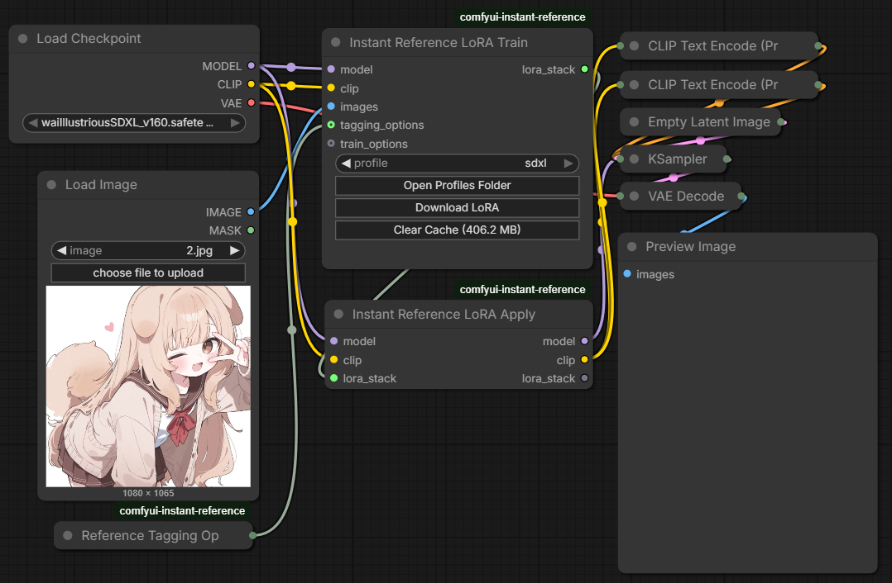

# ComfyUI Instant Reference

A custom node for ComfyUI that turns a reference image set into a quick LoRA and applies it back to the current workflow.

It is aimed at fast character or style adaptation runs with minimal setup. The node prepares captions, runs a lightweight training profile, caches matching runs, and reuses the generated LoRA when possible.
Under the hood, it uses `sd-scripts` for tagging and LoRA training.

This node is still fairly rough and has only been tested with simple workflows so far. If you run into issues, please open an issue with your workflow details and logs.

## Example

## Workflow Example

Drop `assets/workflows.png` into ComfyUI to load the included SDXL example workflow.

## Train/Apply Split Workflow Example

Example layout using `Instant Reference LoRA Train` followed by `Instant Reference LoRA Apply`, with the trained `lora_stack` passed into the apply node.

## Nodes

### Instant Reference LoRA

Main combined node. It takes a reference `IMAGE` batch plus whatever typed inputs the selected profile declares with `{{name:TYPE}}` tokens, prepares captions, runs the selected training profile, caches identical runs, and outputs the patched `MODEL`, patched `CLIP`, generated `lora_path`, and `lora_stack`.

### Instant Reference LoRA Train

Training-only node. It uses the same profile-driven inputs and cache behavior as the combined node, but only trains or reuses a LoRA and outputs it as `lora_stack` for downstream nodes.

### Instant Reference LoRA Apply

Apply-only node. It takes an incoming `lora_stack`, applies each LoRA entry in order to the provided `MODEL` and `CLIP`, and passes the stack through unchanged.

### Reference Tagging Options

Helper node for caption generation settings. Use it to control WD tagger thresholds and basic caption cleanup such as prepending tags, appending tags, excluding tags, replacing tags, and underscore removal.

### Reference Train Options

Helper node for training overrides. Use it to override steps, learning rate, network size, alpha, resolution, seed, caching behavior, and whether to force retraining instead of reusing a cached result.

## Profiles

### SDXL Reference LoRA

Default SDXL-oriented profile based on `sdxl_train_network.py`. It trains a LoCon-style LoRA at `1024x1024`, uses `bf16`, keeps the run short with `50` default steps, and is meant for fast reference adaptation on SDXL checkpoints. Its profile declares only `{{model:MODEL}}`, so only a model slot is exposed alongside the images.

### Anima Reference LoRA

An Anima-oriented profile based on `anima_train_network.py`. It also runs at `1024x1024` with `50` default steps, trains a lightweight LoRA for the UNet only, and its profile declares `{{model:MODEL}}`, `{{clip:CLIP}}`, and `{{vae:VAE}}`, so those sockets are exposed automatically.
